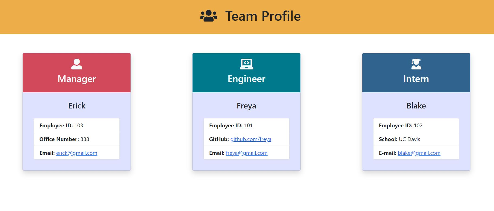

# Team-Profile-Generator

## Description

This is a team profile generator via node.js command-line application. Users will input "node index.js" in the command-line to start a series of questions for the Team Profile. After users complete answering the questions in the command-line, a HTML is generated that displays employee information of the team. 

The technologies I used are HTML, Javascript, and bootstrap for styling. The challenges I faced were building the multiple html and js pages associated to each of the employees and connecting them all together for the genereated team.html. I also ran into test failures and determined that I had a few typos in my test js files. 

## Screen shot

